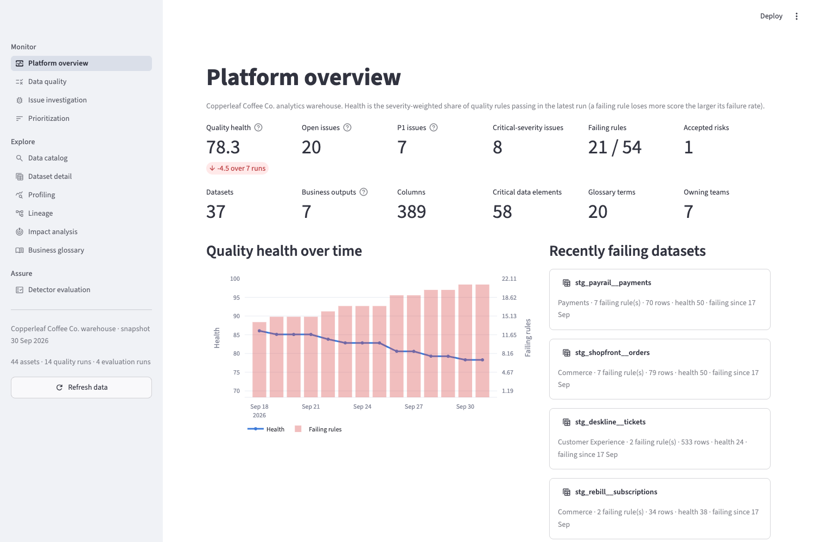
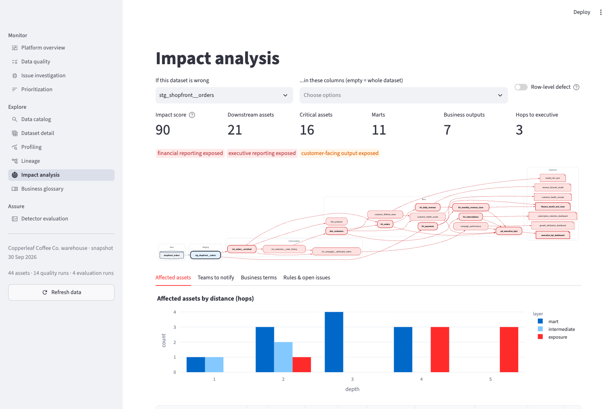
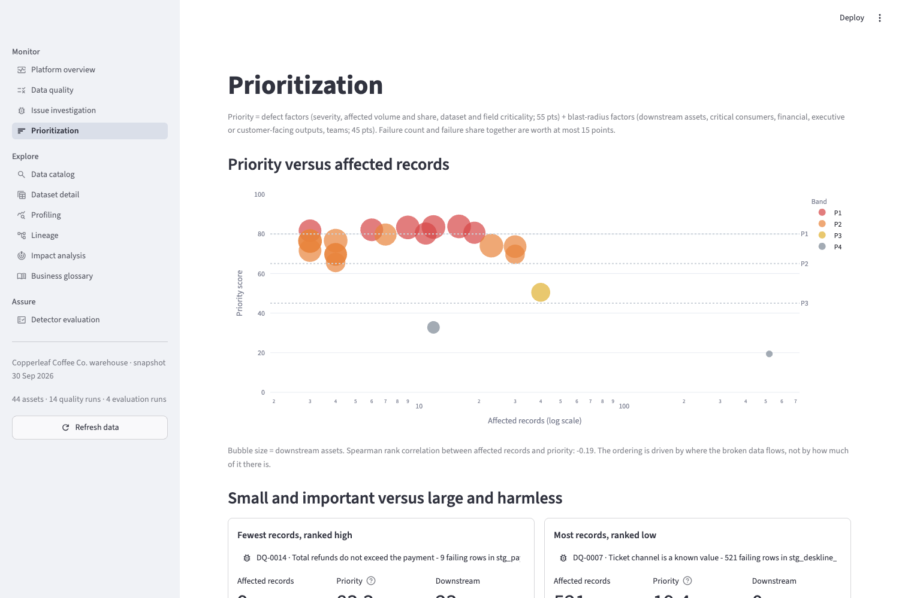
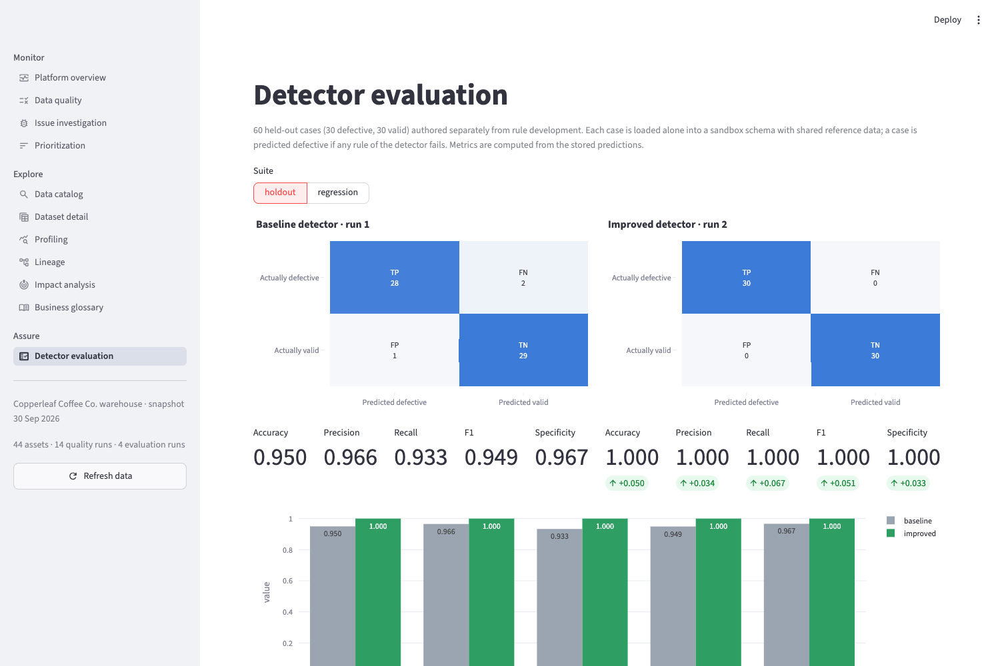
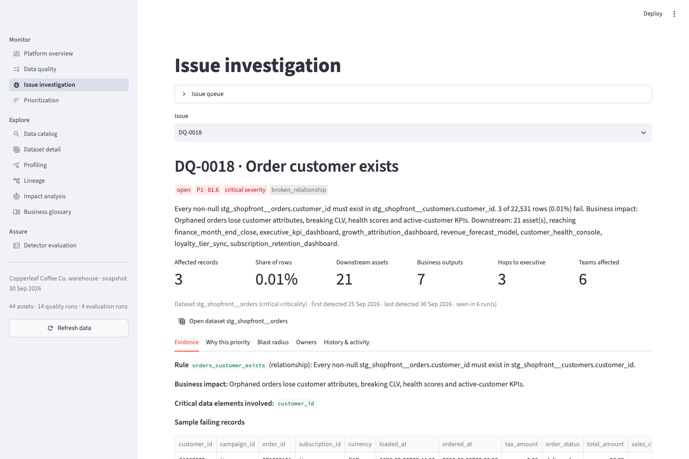
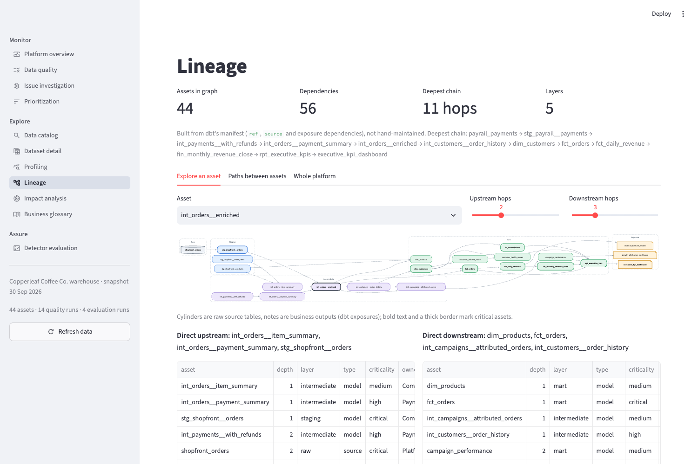
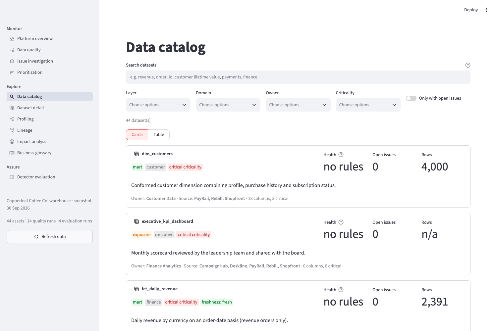
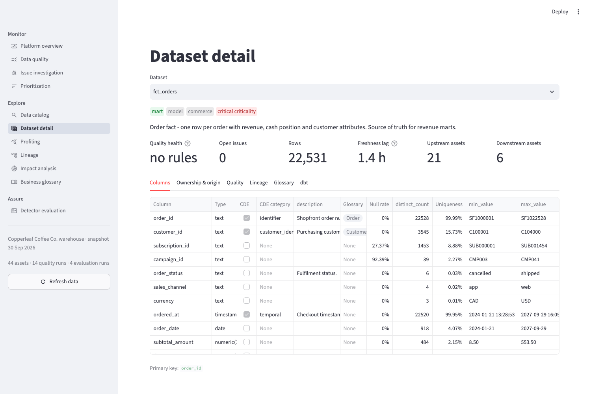
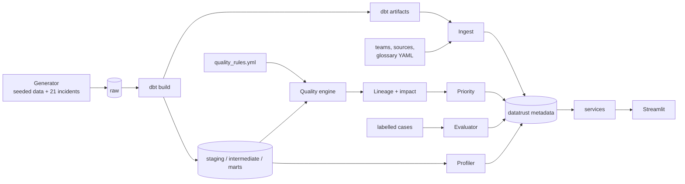

# DataTrust

A data quality and lineage workbench I built on PostgreSQL, dbt and Streamlit.

Most data quality tools stop at "this test failed." In my experience that's the easy part. The questions
that take up an afternoon come after: where did this data come from, who owns it, what reads from it, does it
end up in the finance numbers, and is it worse than the other twelve things that are also red today? DataTrust
is my attempt at answering those questions in one place, and at measuring how good the checks actually are
instead of assuming they work.



## The setup

There's no real company behind this, so I made one up: Copperleaf Coffee Co., an online coffee shop with
subscriptions. It has five source systems:

- Shopfront (the store: customers, products, orders, order lines)
- PayRail (payments and refunds)
- Rebill (subscriptions)
- Deskline (support tickets)
- CampaignHub (marketing campaigns)

A seeded generator produces about 83k rows of data covering January 2024 to a snapshot date of 30 September
2026. It then breaks the data in 21 specific ways that I've seen or can easily imagine happening: an order sync
that replayed and duplicated orders, a payment worker with a skewed clock, a lost cancellation webhook, a
PayRail account merge that pointed payments at the wrong customer, partial refunds that add up to more than was
charged, a new chat widget sending a channel value nobody mapped. For every one of these, the generator records
which rows it touched and which rule should catch it, so I can check the detector against the truth.

On top of that sits a dbt project with 9 staging views (with enforced contracts), 8 intermediate models and 11
marts: order facts, the monthly finance close, CLV, customer health, campaign performance, executive KPIs. Seven
dbt exposures describe who actually consumes the data, e.g. the executive dashboard, the month-end close and a
loyalty tier sync that pushes data back to customers.

The stack is Python, PostgreSQL 15, dbt, Streamlit, psycopg 3, networkx, pydantic and Plotly. Everything is
one database and one Python package. I didn't see a reason for anything heavier at this size.

## What it does

**Catalog.** It reads dbt's `manifest.json` and `catalog.json` and combines them with a few YAML files I keep
for things dbt doesn't know: teams (lead, Slack channel, on-call), source systems, and a glossary. The result
is 44 assets and 389 columns, 58 of them marked as critical data elements, plus 20 glossary terms linked to the
tables and columns they describe. Search tells you why each result matched (name, column, glossary term,
owner...), which matters more than I expected once there are a few dozen tables.

**Profiling.** A generic profiler runs against any table in the catalog: null rates, distinct counts, min/max,
mean and median, top values, sample values, and freshness against each source's SLA. Columns tagged as PII
never get sampled. Every run is saved, so you can look at history.

**Quality checks.** There are 56 rules in [`config/quality_rules.yml`](config/quality_rules.yml), split into 10
rule types: not null, unique, relationship, accepted values, range, not in the future, chronology, row
condition, join condition and aggregate reconciliation. Together they cover missing and duplicate identifiers,
broken relationships, bad dates, events in the wrong order, unknown codes, inconsistent statuses, bad numbers
and cross-table reconciliation. A rule looks like this:

```yaml
- key: payments_customer_matches_order
  name: Payment customer matches the order customer
  category: business_rule
  type: join_condition
  asset: stg_payrail__payments
  columns: [customer_id]
  params:
    reference_asset: stg_shopfront__orders
    join: {order_id: order_id}
    invalid_when: "p.customer_id IS DISTINCT FROM r.customer_id"
  severity: critical
  business_impact: Cash attributed to the wrong customer corrupts customer cash history, CLV and chargebacks.
  rulesets: [improved]
```

Each rule type is a small Python class that compiles the rule into a SQL query returning the bad rows. Table
and column names go through psycopg's identifier quoting, and values are bound as parameters. The few
free-form SQL snippets come only from the rule file and get rejected if they contain anything like `;`, a
comment or a `DROP`. Rules run in Postgres one at a time, so one broken rule can't take the others down.

Rules sit on the staging models, because that's where bad source data enters. I'd rather catch a duplicate
order once in staging and then use lineage to show which marts it reaches than re-run the same check on every
mart.

**Issues.** A failing rule opens an issue. Issues can be open, investigating, accepted (a known risk we're
living with) or resolved. They close themselves when the rule passes again and reopen if it fails again. Every
status change and comment is logged. To get a real trend instead of a single snapshot, the pipeline replays
14 daily runs, each one seeing only the rows that had been loaded by that day. You can watch health drop from
86 to 78 as the incidents land.

**Lineage and impact.** Lineage comes straight from dbt's dependency graph: 56 edges, with the longest chain 11
hops from a raw payments table to the executive dashboard. During ingestion I also scan each model's compiled
SQL to see which upstream columns it uses. That lets impact analysis be a bit smarter: if only
`orders.campaign_id` is broken, it follows the models that read `campaign_id` and leaves the finance close
alone. If it can't tell what a model reads, it assumes the model reads everything. Duplicate rows skip this
pruning entirely, because a duplicated order inflates every join downstream no matter which column you look at.

For any asset (or set of columns) you get what's downstream and how far away it is, which consumers are
critical, whether financial, executive or customer-facing outputs are exposed, which teams to notify, and
which glossary terms are involved. A defect in `stg_shopfront__orders`, for example, reaches 21 assets,
including 7 business outputs, with the executive dashboard 3 hops away.



## Prioritization

This is the part I cared most about. If you sort issues by failing row count, the loudest problem wins, and
the loudest problem is usually not the important one.

The score is a plain sum of points out of 100, configured in
[`config/priority_model.yml`](config/priority_model.yml):

- about the defect itself: severity (20), dataset criticality (10), whether a critical field is involved
  (10), and the number and share of failing rows (8 + 7);
- about what depends on it: number of downstream assets (10), critical downstream assets (10), financial
  reporting downstream (8), an executive or customer-facing output downstream (9, decaying with distance), and
  how many teams are affected (8).

Volume can contribute 15 points at most. Every issue stores how it got its score, line by line, so you can
disagree with it. P1 starts at 80, P2 at 65, P3 at 45.

In the demo data:

- 3 orders pointing at customers that don't exist: they feed 21 downstream assets, including the finance close
  and the executive KPIs. **81.6, P1.**
- 521 support tickets with an unrecognised channel: nothing downstream reads that column. **19.4, P4**, and
  in the demo it's marked as an accepted risk.

Across all 21 issues, the rank correlation between row count and priority is −0.19, which is what I wanted:
the size of a problem barely predicts how much it matters.



## Measuring the checks

I wanted an honest number for how well the rules work, so I wrote 60 labelled test cases, separately from the
rules: 30 contain a defect and 30 are valid but awkward, and every case is a handful of rows across the
staging tables. For each case, the evaluator rebuilds a sandbox schema with the same column types as the dbt
staging contracts, loads just that case, and runs the actual rules. If any rule fires, the case counts as
"defective."

The first version of the rules (the baseline) got:

| | Predicted defective | Predicted valid |
|---|---|---|
| Actually defective | 28 | 2 |
| Actually valid | 1 | 29 |

That's 95% accuracy, 0.966 precision and 0.933 recall. The three mistakes were more interesting than the
score:

- **HO-050, missed.** Two partial refunds of 26.00 and 22.00 on a 44.00 payment. My rule compared each refund
  to the payment, and each one on its own was fine. Together they refunded 4.00 more than was collected. The
  rule checked one row at a time, but the real constraint is on the total.
- **HO-036, missed.** After an account merge, a payment for customer C1001's order was recorded against C1002.
  I checked that the payment's order existed and that its customer existed, and both did. Nothing checked
  that they agreed with each other.
- **HO-059, false alarm.** Support replaced a damaged bag with a free order, and the payment processor logged
  a successful 0.00 payment. My "successful payments must be positive" rule flagged it, even though $0
  replacements are a normal thing to happen.

Each one got a targeted fix: a rule that sums refunds per payment, a rule that compares the payment's
customer with the order's, and a narrower amount rule (0.00 is only suspicious when the order itself isn't
free). The write-up is in [`evaluation/failure_analysis.yml`](evaluation/failure_analysis.yml). I added 10
regression cases that poke at the edges of those fixes: split-tender payments, refunds that exactly match the
charge, a $0 charge on an order that wasn't free, and so on. The improved rules catch all 30 defective held-out
cases with no false alarms, and get all 10 regression cases right.

Two things I was careful about. The baseline isn't deleted or overwritten: it's a separate rule set, and its
runs stay in the history. And the results in [`evaluation/results/`](evaluation/results) are written by the
evaluator, with a test that fails if they ever stop matching a fresh run.

To be upfront: I wrote both the cases and the rules, and I tried to keep them apart. So the perfect score
for the improved rules says the fixes work on the failures I analysed. It doesn't say they'd catch everything in real
production data.



## The app

`make app` starts a Streamlit app at http://localhost:8501 with 11 pages: an overview, quality runs, issue
investigation (with failing sample rows, the score breakdown, a blast-radius graph, who to contact and a
triage form), prioritization, catalog search, dataset detail, profiling, lineage, impact analysis, the
glossary, and the evaluation results.

If something hasn't been built yet (no database, no dbt run, no quality run), each page tells you which
command to run instead of throwing an error. I tried to make it hard to break by clicking around in the
wrong order.

| | |
|---|---|
|  |  |
|  |  |

## How it fits together



The warehouse, DataTrust's own metadata (22 tables in the `datatrust` schema) and the evaluation sandbox all
live in the same Postgres database. The UI pages only call the functions in `datatrust/services/` and never
write SQL themselves.

## Running it

You need Python 3.11 or newer and either Docker or a local Postgres 15. I developed it on a Mac with Python
3.12 and a Homebrew Postgres 15.

```bash
git clone https://github.com/hrithikda/data-trust.git && cd data-trust
make install     # virtualenv + dependencies, copies .env.example to .env
make db-up       # Postgres in Docker (skip this if you already run Postgres)
make pipeline    # builds everything, about 30 seconds
make app
```

If you'd rather use your own Postgres, create a user that's allowed to create databases and put the connection
details in `.env`. All settings are `DATATRUST_*` environment variables, listed in [`.env.example`](.env.example).

```sql
CREATE ROLE datatrust LOGIN PASSWORD 'datatrust' CREATEDB;
```

`make pipeline` runs these steps in order, and each one can also be run on its own and rerun safely:

```bash
datatrust init-db           # create the database and metadata tables
datatrust generate          # new synthetic data (--clean for no defects, --seed / --scale to vary it)
datatrust dbt               # dbt build + docs generate
datatrust ingest            # load dbt artifacts and the YAML config
datatrust profile
datatrust quality backfill --days 14
datatrust triage            # applies a scripted demo triage state
datatrust evaluate          # both rule sets on both test suites
```

There's also `datatrust status` (what's been run so far), `datatrust issue list`, and
`datatrust issue status DQ-0018 investigating --actor "Your Name"`. To run dbt by hand:
`cd dbt && dbt build --profiles-dir .`.

The data is deterministic, so running the pipeline again gives you the same warehouse, issues and scores.

## Tests

```bash
make test               # everything (database tests skip if Postgres isn't running)
make test-unit
make test-db
make test-integration
```

There are 98 tests. The unit tests (62) cover lineage traversal, impact, the priority math, metrics, rule
validation and SQL compilation, the generator, dbt artifact parsing and catalog search. The database tests
(28) run every rule type against small hand-made tables with known bad rows, plus the profiler and the
evaluation. That's where the three baseline mistakes are pinned down: the baseline must still get them wrong,
and the improved rules must get them right for the reason in the write-up.

The integration tests (8) build the whole thing from scratch in a separate `datatrust_test` database so the
demo isn't touched. They check that:

- clean data passes the improved rules;
- every injected incident gets caught;
- issues come out in the expected priority order;
- evaluation history only grows;
- every app page renders.

## Layout

```
app/          Streamlit app (one file per page in views/)
config/       rules, priority weights, teams / sources / glossary, demo triage
datatrust/    the Python package: generator, metadata, profiling, quality, lineage,
              impact, priority, evaluation, services, CLI
dbt/          the dbt project
evaluation/   test cases, failure analysis, saved results
tests/        unit, db and integration tests
```

## Things I'd change or add

- The data and the test cases are synthetic, and I wrote both. Real incidents would be the next step for
  evaluation.
- Column lineage only looks one hop ahead and matches columns by name in the compiled SQL. Renames and
  `SELECT *` are handled conservatively, not traced.
- The priority weights are my judgement. With some history of how issues actually got triaged, I'd tune them
  against that.
- Everything runs as batch commands. In practice I'd put the same commands on a scheduler and post new P1
  issues to the owning team's Slack channel.
- Search is done in memory, which is fine for 44 tables. It would need Postgres full-text search well before
  a thousand.
- There's no login, so triage just records whatever name you type.

MIT licensed.
