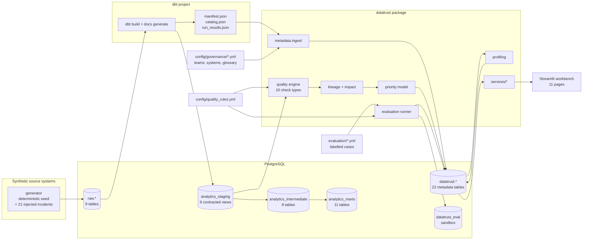
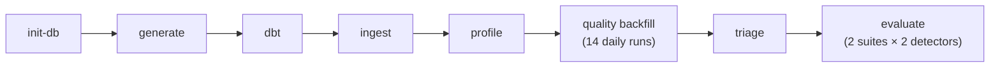
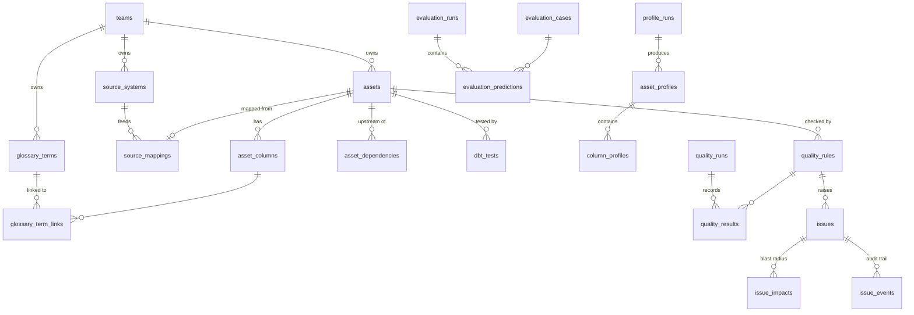
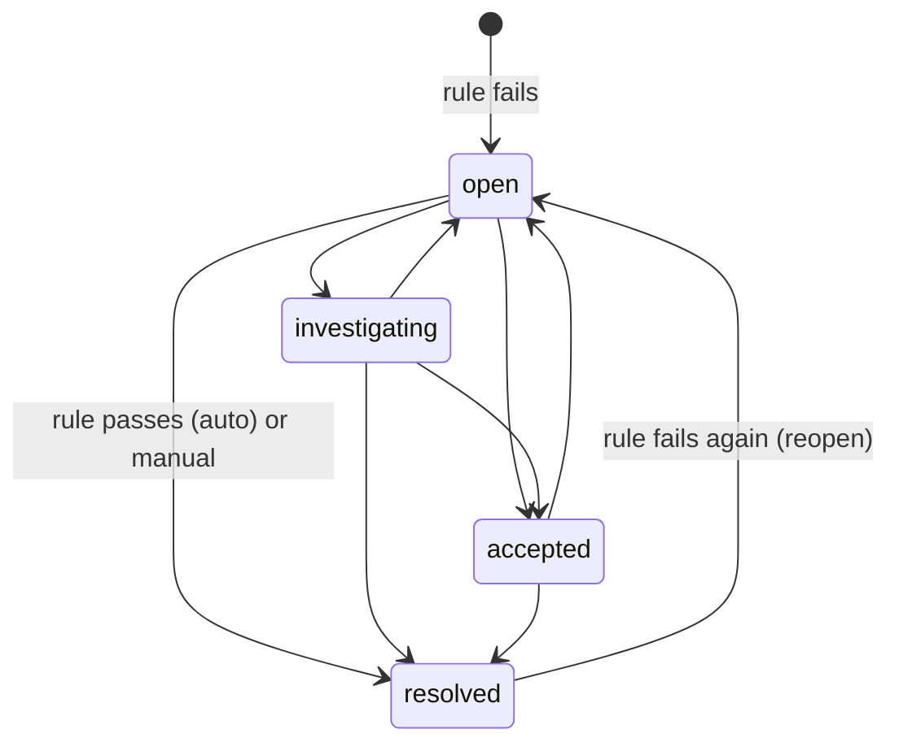

# DataTrust: Data Quality and Lineage Workbench

DataTrust is a metadata, data quality and lineage workbench for an analytics warehouse. It tells a data team
not only *that* a check failed but **what failed, where the data came from, who owns it, what depends on it,
which business concepts are exposed, what to fix first, and how good the detector is at finding real problems.**

It runs against a complete, reproducible warehouse for a fictional company (Copperleaf Coffee Co.): five
source systems, a three-layer dbt project, seven business outputs, and synthetic data with 21 realistic
injected incidents. Everything below was produced by running the code in this repository.


**Stack:** Python 3.11+, PostgreSQL 15, dbt-core/dbt-postgres 1.8+, Streamlit, psycopg 3, networkx,
pydantic, Plotly. No Spark, Kafka, Kubernetes, cloud services or microservices: one database, one Python
package, one dbt project and one Streamlit app.

---

## Contents

- [What it does](#what-it-does)
- [Results at a glance](#results-at-a-glance)
- [Architecture](#architecture)
- [The warehouse: Copperleaf Coffee Co.](#the-warehouse-copperleaf-coffee-co)
- [Metadata model](#metadata-model)
- [Data quality framework](#data-quality-framework)
- [Lineage and impact analysis](#lineage-and-impact-analysis)
- [Priority scoring](#priority-scoring)
- [Detector evaluation](#detector-evaluation)
- [The workbench (Streamlit)](#the-workbench-streamlit)
- [Running it](#running-it)
- [Testing](#testing)
- [Project layout](#project-layout)
- [Design decisions](#design-decisions)
- [Limitations and future work](#limitations-and-future-work)

---

## What it does

| Capability | How it works |
|---|---|
| **Catalog and discovery** | 44 assets (9 raw sources, 28 dbt models, 7 exposures) with 389 columns, ingested from dbt's `manifest.json` / `catalog.json` and combined with governance YAML. Search ranks matches on name, column, glossary term, owner, domain, source system and description, and says why each result matched. |
| **Business context** | 7 owning teams with lead, Slack channel and on-call rotation; 5 source systems with source-to-raw-table mappings; 20 glossary terms linked to 54 assets and columns; 58 critical data elements tagged with a category (identifier, financial, ...). |
| **Profiling** | Generic profiler for any catalogued relation: row count, null rate, distinct count, uniqueness, min/max/mean/median/stddev, top values, samples, and freshness against per-source SLAs. PII columns are never sampled. Each run is persisted. |
| **Quality detection** | 56 declarative rules in 10 rule types covering 11 defect categories, compiled to parameterised SQL and executed in PostgreSQL. Results, failing-row samples and health scores are stored per run, over 14 daily backfilled runs. |
| **Issue management** | One tracked issue per failing rule, with statuses `open`, `investigating`, `accepted` and `resolved`. Issues auto-resolve when the rule passes and reopen when it fails again. Every transition and comment is audited. |
| **Lineage** | Built from dbt `depends_on` (56 edges, deepest chain 11 hops) and annotated with the columns each model reads. Supports direct and transitive upstream/downstream traversal, depth limits, and all paths between two assets. |
| **Impact analysis** | Blast radius of a defect in an asset or specific columns: downstream assets by depth, critical consumers, financial, executive and customer-facing outputs, teams to notify, and exposed glossary terms. |
| **Prioritization** | Transparent, additive, configurable score. Failure count and failure share are worth at most 15 of 100 points; the rest comes from severity, criticality and blast radius. |
| **Evaluation** | Two detector versions (`baseline`, `improved`) evaluated by real rule execution on 60 held-out labelled cases plus a 10-case regression suite. Runs are append-only, so the baseline result stays visible. |

## Results at a glance

These numbers are computed by `datatrust pipeline`. Integration tests rerun the same steps in a throwaway
database, and DB tests rerun the evaluation in a sandbox; together they assert the values below.

**Detector evaluation on 60 held-out cases (30 defective, 30 valid):**

| Detector | TP | FN | FP | TN | Accuracy | Precision | Recall | F1 | Specificity |
|---|---|---|---|---|---|---|---|---|---|
| baseline | 28 | 2 | 1 | 29 | 0.950 | 0.966 | 0.933 | 0.949 | 0.967 |
| improved | 30 | 0 | 0 | 30 | 1.000 | 1.000 | 1.000 | 1.000 | 1.000 |

The baseline's three errors are analysed in [`evaluation/failure_analysis.yml`](evaluation/failure_analysis.yml)
and fixed by three targeted rule changes, each covered by regression cases and tests ([details](#detector-evaluation)).
The committed JSON in [`evaluation/results/`](evaluation/results) is written by the runner, and
`tests/db/test_evaluation.py` fails if it differs from a fresh run.

**A small, important defect outranks a large, harmless one:**

| Issue | Affected records | Downstream assets | Priority |
|---|---|---|---|
| `orders_customer_exists`: orders pointing at customers that do not exist | 3 of 22,531 | 21 (finance close, executive KPIs, CLV, ...) | **81.6, P1** |
| `refunds_cumulative_not_exceeding_payment`: partial refunds adding up past the capture | 9 | 23 | **83.3, P1** |
| `tickets_channel_accepted_values`: new chat widget writes `chat_widget_v2` | 521 | 0 | **19.4, P4** (accepted risk) |

The Spearman rank correlation between affected records and priority across the 21 demo issues is −0.19.
The ordering comes from where the broken data flows, not from how much of it there is.

**On clean data** (generated without defects and built through dbt), the improved rules raise nothing. The
baseline flags 35 legitimate $0.00 support-replacement payments, the same false-positive pattern as held-out
case HO-059 (asserted in `tests/integration/test_pipeline.py`).

## Architecture



All three schemas live in one PostgreSQL database. The Python package is layered: domain modules
(`quality`, `lineage`, `impact`, `priority`, `profiling`, `evaluation`) have no UI code; `datatrust/services/`
turns them into page-shaped read models; the Streamlit pages only call services and never issue SQL.
`datatrust pipeline` runs the steps in order:



A full rebuild takes about 30 seconds and is deterministic: rerunning it reproduces the same warehouse, issues,
priorities and evaluation results.

## The warehouse: Copperleaf Coffee Co.

Copperleaf sells coffee and equipment online and through subscriptions. The data covers 2024-01 to the
snapshot date of 2026-09-30.

| Source system | What it is | Raw tables | Freshness SLA |
|---|---|---|---|
| Shopfront | E-commerce platform | customers, products, orders, order_items | orders and order items 6 h, customers 48 h |
| PayRail | Payment processor | payments, refunds | payments 2 h, refunds 48 h |
| Rebill | Subscription billing | subscriptions | 72 h |
| Deskline | Support desk | tickets | 24 h |
| CampaignHub | Marketing campaigns | campaigns | none |

The dbt project (`dbt/`) has 9 **staging** views with enforced contracts, 8 **intermediate** models (order
enrichment, payment and refund rollups, attribution, subscription MRR, support summaries) and 11 **marts**:
core dimensions and facts, the finance close, daily revenue, CLV, customer health, campaign performance and
executive KPIs. Seven **exposures** declare the business outputs with owners and audiences:
`executive_kpi_dashboard`, `finance_month_end_close`, `revenue_forecast_model`, `loyalty_tier_sync`,
`customer_health_console`, `growth_attribution_dashboard` and `subscription_retention_dashboard`.

Model `meta` carries ownership, criticality and freshness settings; column `meta` marks critical data elements
and PII. dbt's own tests (43, run with `severity: warn` so the build completes on defective data) are ingested
next to DataTrust's results.

**Injected incidents.** `datatrust/generator/defects.py` applies 21 incidents to clean data, such as a replayed
order sync, a clock-skewed payment worker, a lost cancellation webhook, a PayRail account merge, partial refunds
that add up past the capture, and a new chat widget emitting an unmapped channel. Each incident records ground
truth: affected record ids, expected failing rows and the rule expected to catch it. Incidents never overlap on
a record, and many are concentrated in the last two weeks, so the backfilled health trend declines the way it
would during a real incident. The integration test checks that every injected incident is caught by its rule.

## Metadata model

The `datatrust` schema has 22 tables ([`datatrust/sql/metadata_schema.sql`](datatrust/sql/metadata_schema.sql)),
with foreign keys, check constraints on every enumerated status, and a partial unique index guaranteeing at
most one unresolved issue per rule.



| Group | Tables |
|---|---|
| Ownership and governance | `teams`, `source_systems`, `source_mappings`, `glossary_terms`, `glossary_term_links` |
| Technical metadata | `assets`, `asset_columns`, `asset_dependencies` (with `referenced_columns`), `dbt_tests` |
| Profiling | `profile_runs`, `asset_profiles`, `column_profiles` |
| Quality | `quality_rules`, `quality_runs`, `quality_results` (counts, failure rate, samples, health weight) |
| Issues | `issues` (priority score, band and factor breakdown), `issue_impacts`, `issue_events` |
| Evaluation | `evaluation_cases` (content-hashed), `evaluation_runs`, `evaluation_predictions` |
| Operations | `pipeline_events` |

Ingestion is idempotent: assets and columns are upserted on stable dbt `unique_id`s, while dependencies and
glossary links are replaced. Columns that disappear from dbt are deactivated, not deleted, so history keeps
its references.

## Data quality framework

Rules are declarative YAML ([`config/quality_rules.yml`](config/quality_rules.yml)) and validated with pydantic
on load: known category and type, identifier-safe column names, type-specific parameters with unknown keys
rejected, unique keys, and valid `supersedes` references. They are then checked against the ingested catalog
(every referenced asset and column must exist).

```yaml
- key: payments_customer_matches_order
  name: Payment customer matches the order customer
  category: business_rule
  type: join_condition
  asset: stg_payrail__payments
  columns: [customer_id]
  params:
    reference_asset: stg_shopfront__orders
    join: {order_id: order_id}
    invalid_when: "p.customer_id IS DISTINCT FROM r.customer_id"
    context_columns: [customer_id]
  severity: critical
  business_impact: Cash attributed to the wrong customer corrupts customer cash history, CLV and chargeback handling.
  rulesets: [improved]
  rationale: Baseline false negative HO-036 ...
```

| Rule type | Detects | Categories covered |
|---|---|---|
| `not_null` | missing values | missing identifiers |
| `unique` | repeated keys | duplicate identifiers |
| `relationship` | orphaned foreign keys | broken relationships |
| `accepted_values` | unknown codes | invalid categorical values |
| `range` | out-of-bounds numbers or dates, optionally scoped with `where` | invalid numeric values, invalid dates |
| `not_future` | timestamps after the data cutoff | invalid or impossible dates |
| `chronology` | events out of order, within a row or across a join | incorrect chronology |
| `row_condition` | any row-level business predicate | inconsistent statuses, financial consistency |
| `join_condition` | predicates across two tables | cross-table business rules |
| `aggregate_reconciliation` | a parent value vs an aggregate of child rows (`equal` or `child_lte_primary`) | cross-table reconciliation, financial consistency |

**Execution.** Each check compiles to one query returning the *failing rows* of its asset (aliased `p`). The
engine wraps it to count scanned and failing rows and to fetch samples. Identifiers go through
`psycopg.sql.Identifier`, constants through `sql.Literal`, and the cutoff timestamp is a bound parameter.
Free-form expressions come only from the version-controlled rule file, and statement separators, comments and
DML/DDL keywords are rejected. Join checks deduplicate on a synthetic row id, so a row that matches two
reference rows still counts once. Rules run on one autocommit connection with a statement timeout, so a broken
rule is recorded as `error` without affecting the others. Adding a rule type means adding one `Check` subclass
to the registry in `datatrust/quality/checks.py`.

**Health.** A passing rule scores 1. A failing rule scores at most 0.5 and falls linearly to 0 at a 5% failure
rate. Health is the severity-weighted mean (low 1 to critical 4) × 100, excluding errored rules.

**History.** `datatrust quality backfill --days 14` replays daily runs, each seeing only rows with
`loaded_at` up to that day, so the demo has a real trend (86.1 down to 78.3) instead of a single snapshot.

**Issue lifecycle.**



While an issue is unresolved, each run refreshes its counts, samples, blast radius and priority.
`config/demo_triage.yml` scripts a realistic triage state for the demo (two issues under investigation, one
accepted risk with a justification, and a comment). It is applied by the same code path the UI form uses.

## Lineage and impact analysis

`LineageGraph` (networkx DAG) is built from `asset_dependencies`; cycles are rejected. Traversals:
`direct_upstream/downstream`, `all_upstream/downstream`, `upstream_depths/downstream_depths` (minimum hops),
`shortest_path`, `all_paths` (shortest first, capped), `neighbourhood(n, up, down)` and `longest_chain`.

During ingestion, DataTrust parses each model's compiled SQL to record which upstream columns it reads
(`asset_dependencies.referenced_columns`). Impact analysis uses this to **prune the first hop**: a defect
confined to `stg_shopfront__orders.campaign_id` only reaches the models that read `campaign_id`, not the finance
close. Unknown references count as "reads everything", so pruning never hides impact. Beyond the first hop the
defect is assumed to travel with the derived rows. **Row-level** defects (duplicate identifiers) bypass pruning,
because duplicated rows fan out every join downstream.


An `ImpactReport` lists impacted assets with depth and path, critical consumers, marts and exposures; flags
financial, executive and customer-facing exposure with hops to the nearest executive output; names the owner
first, then every downstream team; and lists the glossary terms exposed (column-level terms for the affected
columns plus asset-level terms downstream), the related rules and the upstream source systems. Example from
the demo: a defect in `stg_shopfront__orders` reaches 21 assets (16 critical, 11 marts, 7 business outputs,
executive reporting 3 hops away), with an impact score of 90/100. The Impact page also supports "what if"
analysis for any asset and column selection, without needing an issue.

## Priority scoring

The priority score is a sum of capped factor points (0–100), configured in
[`config/priority_model.yml`](config/priority_model.yml). The model refuses to load if the maxima don't sum to
100. Every factor is stored on the issue with its points and a plain-language reason, so any score can be
audited in the UI.

| Group | Factor | Max | Rule |
|---|---|---|---|
| Defect | Severity | 20 | critical 20, high 14, medium 8, low 3 |
| Defect | Affected records | 8 | log-scaled, saturates at 10,000 |
| Defect | Affected share | 7 | linear, saturates at 5% |
| Defect | Dataset criticality | 10 | critical 10, high 7, medium 4, low 1 |
| Defect | Field criticality | 10 | 6 if a critical data element fails, +4 if it is financial or an identifier |
| Blast radius | Downstream dependencies | 10 | linear up to 25 assets |
| Blast radius | Critical consumers | 10 | 0.5 per high or critical downstream asset |
| Blast radius | Financial reporting | 8 | any financial-reporting asset downstream |
| Blast radius | Executive / customer-facing | 9 | 9 if executive output is within 2 hops, −1 per extra hop (minimum 5); 7 for customer-facing |
| Blast radius | Teams affected | 8 | 1.6 per additional team |

Bands: **P1** ≥ 80, **P2** ≥ 65, **P3** ≥ 45, otherwise **P4**. The blast-radius group alone, normalised to
0–100, is the *impact score* shown on the Impact page.


## Detector evaluation

**Method.** [`evaluation/holdout_cases.yml`](evaluation/holdout_cases.yml) holds 60 labelled cases, 30 defective
and 30 valid, written separately from rule development. Each case is a handful of records across staging tables,
with a shared reference context (customers, products, a campaign). For every case, the runner:

1. recreates `datatrust_eval` with one table per staging model, using the **dbt contract column types from the
   manifest**, so the rules run exactly as they do on the warehouse;
2. loads the shared context plus that case's records alone;
3. executes every rule of the detector version under test. If any rule fails, the case is predicted
   `defective`; otherwise it is predicted `valid`.

Predictions, triggered rules and metrics are stored in `evaluation_runs` and `evaluation_predictions` together
with a content hash of the cases, so a run can be tied to the exact inputs it saw. Nothing is hardcoded:
change a rule or a case and the matrix changes. Runs are append-only. The baseline is a separate detector
version and keeps its own rows, so evaluating the improved detector never overwrites it.


**Failure analysis of the baseline** ([`evaluation/failure_analysis.yml`](evaluation/failure_analysis.yml)):

| Case | Error | Pattern | Root cause | Fix |
|---|---|---|---|---|
| HO-050 | false negative | Aggregate constraint checked row by row | Two partial refunds (26.00 + 22.00) against a 44.00 capture. Each is smaller than the payment, so the per-row rule `refunds_not_exceeding_payment` passes, yet together they return 4.00 more than was collected. | `refunds_cumulative_not_exceeding_payment`: an `aggregate_reconciliation` that sums refunds per payment |
| HO-036 | false negative | Individually valid, jointly inconsistent references | After a PayRail account merge, a capture for customer C1001's order is recorded against C1002. `order_id` and `customer_id` each exist, and nothing compares them. | `payments_customer_matches_order`: a `join_condition` requiring the payment's customer to match the order's (NULL-safe) |
| HO-059 | false positive | Naive bound that ignores a legitimate process | Support replaced a damaged bag with a 100%-discounted order; PayRail records a 0.00 succeeded authorisation. `payments_succeeded_amount_positive` (amount > 0) flags it. | `payments_succeeded_amount_valid`: negative is invalid; 0.00 is invalid only if the order total is not 0.00 or the order is missing |

The two replacing rules declare `supersedes:` and the baseline rules remain tagged `rulesets: [baseline]`.
The baseline detector stays reproducible, and the UI shows which rule replaced which and why.

**Regression suite.** [`evaluation/regression_cases.yml`](evaluation/regression_cases.yml) has 10 cases that
probe the edges of each fix. The defective cases are: three partial refunds; refunds exceeding one leg of a
split-tender payment; a mismatch on the second split leg; a $0 capture on a paid order; a $0 payment for an
unknown order; and a negative payment on a $0 order. The valid cases are: refunds exactly equal to the
capture; a two-line $0 replacement; a split tender with a consistent customer; and refunds spread across split
legs. Baseline result: 3 TP, 3 FN, 1 FP, 3 TN. Improved result: 6 TP, 0 FN, 0 FP, 4 TN.

**Regression tests** (`tests/db/test_evaluation.py`) execute both detectors on both suites and assert:

- the baseline matrix is exactly 28/2/1/29, and its errors are exactly HO-036, HO-050 (FN) and HO-059 (FP);
- for each of those three cases, the baseline stays wrong and the improved detector is right *for the
  documented reason* (the specific new rule fires, or nothing fires for HO-059);
- no case the baseline got right is lost by the improved detector;
- the regression suite matrices, and that the narrower $0 rule still catches the $0 capture on a paid order;
- the committed result snapshots in `evaluation/results/` equal a fresh run.

## The workbench (Streamlit)

```bash
make app        # http://localhost:8501
```

| Section | Page | What it answers |
|---|---|---|
| Monitor | Platform overview | Health and trend, open, P1 and accepted issues, failing datasets, pipeline activity |
| | Data quality | Run history, category trends, per-asset health, rule history, each rule's compiled SQL |
| | Issue investigation | Queue, evidence (failing samples with joined context), priority breakdown, blast-radius graph, owners to contact, history, and a triage form (status changes and comments) |
| | Prioritization | Priority vs affected records, small-vs-large comparison, score composition of every issue |
| Explore | Data catalog | Search with match reasons, filters, cards or table |
| | Dataset detail | Columns with CDE, glossary and profile; ownership and origin; rules and issues, including upstream issues that reach this dataset; lineage; dbt tests |
| | Profiling | Freshness against SLA, column statistics, profile history |
| | Lineage | Explore an asset by hops, paths between any two assets, whole-platform graph |
| | Impact analysis | What breaks if this asset or these columns are wrong |
| | Business glossary | Terms, definitions, calculations, owners and linked fields |
| Assure | Detector evaluation | Confusion matrices, metric comparison, failure analysis, regression coverage, every prediction |

| | |
|---|---|
|  |  |
|  |  |

Every page checks readiness first. If the database is down, a schema is missing or a step hasn't run, the page
says which `make` target to run instead of raising an error. Pages deep-link to each other (`?issue=DQ-0018`,
`?asset=fct_orders`).

## Running it

**Prerequisites:** Python 3.11+, and either Docker or a local PostgreSQL 15+. Developed and validated on
macOS with Python 3.12, dbt-core 1.12 and PostgreSQL 15.

```bash
git clone https://github.com/hrithikda/data-trust.git && cd data-trust
make install          # .venv with DataTrust + dev tools; copies .env.example to .env
make db-up            # PostgreSQL 15 in Docker (skip if you have a local server; see below)
make pipeline         # init-db → generate → dbt → ingest → profile → quality → triage → evaluate (~30 s)
make app              # http://localhost:8501
```

**Using an existing PostgreSQL** instead of Docker: create a role that can create databases, then put the
connection settings in `.env`. Every setting is an environment variable with the `DATATRUST_` prefix (see
[`.env.example`](.env.example)), and no secret is hardcoded.

```sql
CREATE ROLE datatrust LOGIN PASSWORD 'datatrust' CREATEDB;
```

`datatrust init-db` creates the database if it is missing. If port 5432 is already taken, set
`DATATRUST_DB_PORT` (docker-compose uses the same variable).

**Individual steps.** Each step can be run alone and rerun safely:

| Command | Does |
|---|---|
| `datatrust init-db [--reset]` | create the database and metadata schema (`--reset` drops history) |
| `datatrust generate [--seed N] [--scale X] [--clean]` | regenerate source data and reload `raw` (`--clean`: no injected defects); writes CSVs and the ground-truth `defect_manifest.json` to `data/generated/` |
| `datatrust dbt` | `dbt build` (models and tests) and `dbt docs generate` with DataTrust's connection settings |
| `datatrust ingest` | load dbt artifacts and governance config into the catalog |
| `datatrust profile [--asset NAME]` | profile relations |
| `datatrust quality run [--ruleset baseline\|improved]` / `quality backfill --days 14` | execute rules, update issues |
| `datatrust evaluate [--suite holdout\|regression\|all] [--detector ...] [--dry-run]` | run the evaluation |
| `datatrust issue list` / `issue status DQ-0018 investigating --actor "Name"` / `issue comment ...` | triage from the terminal |
| `datatrust status` | which steps have run, and what to run next |

Matching `make` targets exist (`make help`). To run dbt directly:
`cd dbt && dbt build --profiles-dir .`. The profile reads the same `DATATRUST_DB_*` variables.

**Configuration** lives in `config/`: governance (`governance/teams.yml`, `source_systems.yml`, `glossary.yml`),
`quality_rules.yml`, `priority_model.yml` and `demo_triage.yml`. Invalid configuration fails fast with a
message naming the problem (exit code 2 for settings, 1 for other DataTrust errors).

## Testing

```bash
make test               # everything; DB tests skip with a hint if PostgreSQL is unreachable
make test-unit          # no database needed
make test-db            # engine, profiler and evaluation against PostgreSQL (scratch schemas)
make test-integration   # whole platform in a throwaway database (~40 s)
make lint
```

98 tests across three layers:

- **Unit** (`tests/unit`, 62 tests): lineage traversal, depths, column pruning and cycle rejection; impact
  reports; priority model maths, caps, bands, executive decay, config validation, and the small-vs-large
  ordering; confusion-matrix metrics and edge cases; health scoring; profiler type families, freshness and PII
  suppression in the compiled SQL; rule validation, SQL compilation (identifier quoting, bound parameters,
  forbidden constructs); generator determinism, clean-data invariants and ground-truth integrity; dbt artifact
  parsing (real artifacts and corrupted meta); governance cross-references; evaluation suite balance and
  failure-analysis references; catalog search ranking; DOT rendering.
- **Database** (`tests/db`, 28 tests): every check type on hand-built tables with known bad rows, join
  deduplication, scope and backfill filtering, error isolation; profiler statistics; the evaluation regression
  tests described above.
- **Integration** (`tests/integration`, 8 tests): builds everything in a separate `datatrust_test` database
  from a copy of the dbt project, so the demo and `dbt/target` are untouched. It checks: clean data passes the
  improved rules; every injected incident is detected; the CLI pipeline produces prioritised issues, triage
  and history; downstream datasets list the upstream issues reaching them; evaluation history is append-only;
  and all 11 Streamlit pages render through `streamlit.testing`.

## Project layout

```
app/                      Streamlit entry point, shared UI helpers, one module per page (views/)
config/                   governance YAML, quality rules, priority model, demo triage
datatrust/
  cli.py                  `datatrust` command
  config.py, db.py        settings (env / .env) and parameterised PostgreSQL access
  generator/              Copperleaf domain, deterministic data, defect injection with ground truth
  metadata/               dbt runner, artifact parser, governance loader, idempotent ingestion
  profiling/              profiler
  quality/                rule model, check types, engine, health, issues, run service, triage
  lineage/, impact/       lineage graph and impact analysis
  priority/               priority model
  evaluation/             cases, sandbox, metrics, runner
  services/               read models used by the UI
  sql/                    raw and metadata DDL
dbt/                      dbt project (staging, intermediate, marts, exposures, singular test, macros)
evaluation/               held-out and regression cases, failure analysis, result snapshots
scripts/                  README screenshot capture
tests/                    unit, db and integration tests
```

## Design decisions

- **The evaluation runs the production rules, not a model of them.** The sandbox is built from the dbt
  contracts, and cases go through the same engine and SQL. A metric can only change if a rule or a case changes.
- **Rules are data, checks are code.** Fifty-six rules in YAML; ten small check classes compile them. Reviewers
  can read a rule without reading Python, and a new rule type is one class.
- **Rules target staging models.** Staging is where source defects enter the warehouse and where contracts pin
  the columns. Downstream assets inherit issues through lineage instead of re-running every check on every mart.
  The dataset page lists the upstream issues that reach each mart.
- **Lineage comes from dbt, not hand-maintained diagrams.** Column references come from compiled SQL, giving
  column-aware pruning without a full SQL parser. Unknown references fail open (count as impacted).
- **Additive priority instead of a learned or multiplicative score.** With no labelled remediation history, an
  auditable sum with capped, configurable factors is easier to defend and tune. Volume is deliberately capped at
  15 points.
- **History is append-only.** Quality runs, issue events and evaluation runs are never rewritten; the baseline
  detector stays reproducible beside the improved one.
- **One database, one process.** The workload (tens of assets, about 83k raw rows) does not justify distributed
  infrastructure. PostgreSQL holds the warehouse, the metadata and the sandbox.
- **In-memory catalog search.** For 44 assets, ranking in Python lets every hit explain why it matched. At
  thousands of assets this would move to PostgreSQL full-text search.

## Limitations and future work

- **Synthetic data.** The company, incidents and evaluation cases were designed for this project. The held-out
  cases were written separately from the rules, but by the same author, so the 60-case result shows the method
  rather than proving performance on unseen production data. The improved detector's perfect score is on cases
  whose failure patterns were analysed; it is not an estimate of real-world recall.
- **Batch, not streaming.** Runs are triggered by CLI or `make`. A scheduler (cron, Airflow, Dagster) would call
  the same commands.
- **Column lineage is first-hop only.** Columns are matched by name in compiled SQL. Expressions, renames
  further downstream and `SELECT *` are handled conservatively, not traced.
- **Priority weights are expert-set.** Recorded triage outcomes could later be used to calibrate them.
- **Single tenant, no auth.** The Streamlit app trusts its user; triage records a typed actor name.
- **Possible extensions:** alerting to the owning team's Slack channel on new P1 issues; anomaly checks on
  volume and distribution drift using the stored profiles; dbt Cloud or OpenLineage ingestion; and
  PostgreSQL-backed search for larger catalogs.
